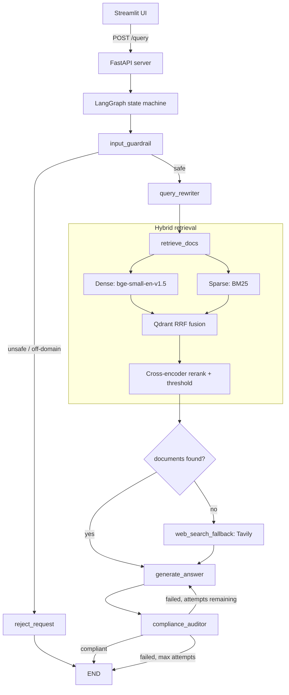
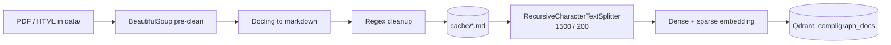

# CompliGraph AI

An agentic RAG system for financial and regulatory compliance questions, built as a LangGraph state machine with hybrid retrieval, cross-encoder reranking, and an LLM audit loop.

## Overview

Regulatory documents are a difficult retrieval target. Answers depend on exact
thresholds, dates, circular numbers and clause identifiers, so a wrong or
partially-relevant passage produces an answer that is confidently incorrect —
which in a compliance setting is worse than no answer.

CompliGraph AI addresses this in three ways:

1. **Hybrid retrieval.** Dense embeddings alone miss exact regulatory
   identifiers (`UBD.BPD.CO./NSB1/11/12.03.000`); BM25 alone misses paraphrased
   concepts. Both run in parallel and are fused with Reciprocal Rank Fusion
   inside Qdrant, then reranked with a cross-encoder.
2. **An explicit audit step.** After generation, a separate LLM call checks
   every factual claim against the retrieved sources and can send the answer
   back for regeneration with specific correction feedback.
3. **Measured, not asserted.** The retrieval and answer quality are evaluated
   with RAGAS against a generated benchmark, and the retrieval hyperparameters
   are tuned with Optuna rather than picked by hand.

The corpus used during development consists of SEC Form 10-K filings, RBI
circulars (KYC and related directives), and Basel III / academic
banking-regulation working papers.

## Key Features

- Hybrid dense + sparse retrieval with server-side RRF fusion in Qdrant
- Cross-encoder reranking (`BAAI/bge-reranker-base`) over the fused candidates
- Multi-query expansion: an LLM rewrites the question into up to 3 regulatory
  search queries, all of which are searched alongside the original
- LLM compliance auditor with a bounded regeneration loop (max 2 attempts)
- Tavily web-search fallback when the vector store returns nothing relevant
- Input guardrail node for off-domain and prompt-injection filtering
- Pydantic structured outputs on every LLM call — no free-text parsing
- Docling-based PDF/HTML parsing with BeautifulSoup pre-cleaning and a
  markdown cache
- FastAPI backend with a Streamlit chat frontend, communicating over HTTP
- RAGAS evaluation harness (faithfulness, answer correctness, context
  precision, context recall)
- Optuna study for retrieval hyperparameter search

## Architecture

Ingestion runs offline and is independent of the serving path:

## Tech Stack

| Layer | Technology |
|---|---|
| Orchestration | LangGraph, LangChain Core |
| LLM | Gemini (`gemini-3.7-flash`) via `langchain-google-genai` |
| Vector store | Qdrant (embedded / local mode) |
| Dense embeddings | FastEmbed, `BAAI/bge-small-en-v1.5` |
| Sparse embeddings | FastEmbed, `Qdrant/bm25` |
| Reranker | sentence-transformers `CrossEncoder`, `BAAI/bge-reranker-base` |
| Document parsing | Docling, BeautifulSoup |
| Web fallback | Tavily (`langchain-tavily`) |
| API | FastAPI, Uvicorn |
| UI | Streamlit |
| Evaluation | RAGAS, Optuna, pandas |

## Project Structure
